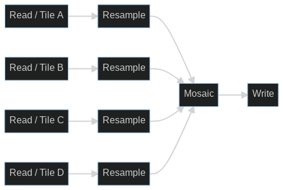
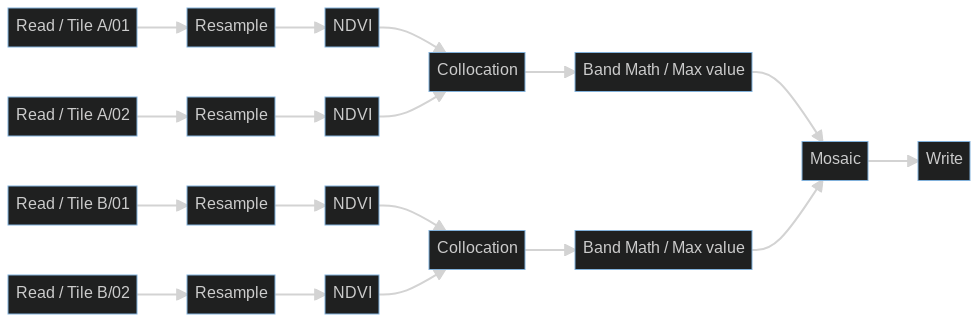
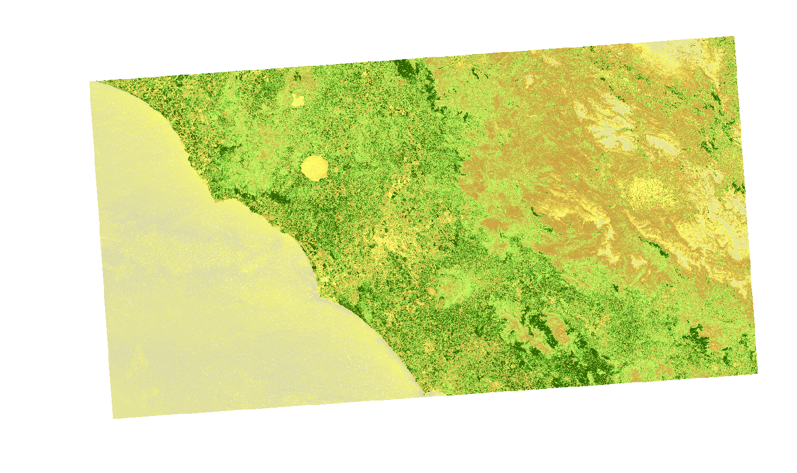

# earth-in-the-cloud

## mosaicing

### Workflow

### Avvio

1. Scarica i prodotti di input
   - Il test e' stato eseguito sui seguenti 4 prodotti
     - PDGS Processing Baseline number: N0400
     - Relative Orbit number: R122
     - Tile number field: T32TQM, T32TQN, T33TUG, T33TUH
2. Aggiorna il codice con i percorsi corretti
3. Avvia lo script `python3 ./mosaicing/execute_gpt_graph.py ./mosaicing/sentinel2-mosaic.xml`

### Output

Tempo di esecuzione: ~20min
## NDVI

### Workflow

### Avvio
1. Scarica i prodotti di input
   - Il test e' stato eseguito sui seguenti 4 prodotti
     - PDGS Processing Baseline number: N0400
     - Relative Orbit number: R122
     - Tile number field: T33TUG, T33TTG
     - Tile date: 06/03/2022, 16/03/2022
2. Posiziona i file opportunamente (vedi percorsi sotto)
3. Esegui
   - Terminale
     1. `SAT_DATA_PATH=...` cartella con i 4 .zip (vedi percorsi sotto)
     2. `gpt ./ndvi/sentinel2-ndvi.xml -Pin_a1=$SAT_DATA_PATH/T33TTG/S2A_MSIL2A_20220306T100031_N0400_R122_T33TTG_20220306T120714.zip -Pin_a2=$SAT_DATA_PATH/T33TTG/S2A_MSIL2A_20220316T100031_N0400_R122_T33TTG_20220316T134748.zip -Pin_b1=$SAT_DATA_PATH/T33TUG/S2A_MSIL2A_20220306T100031_N0400_R122_T33TUG_20220306T120714.zip -Pin_b2=$SAT_DATA_PATH/T33TUG/S2A_MSIL2A_20220316T100031_N0400_R122_T33TUG_20220316T134748.zip -t $SAT_DATA_PATH/output.dim`
   - Python (TODO)

### Output 

Tempo di esecuzione: ~3min

Dopo aver aperto il risultato del workflow su SNAP e assegnato opportuna banda di colori, di seguito il risultato 

